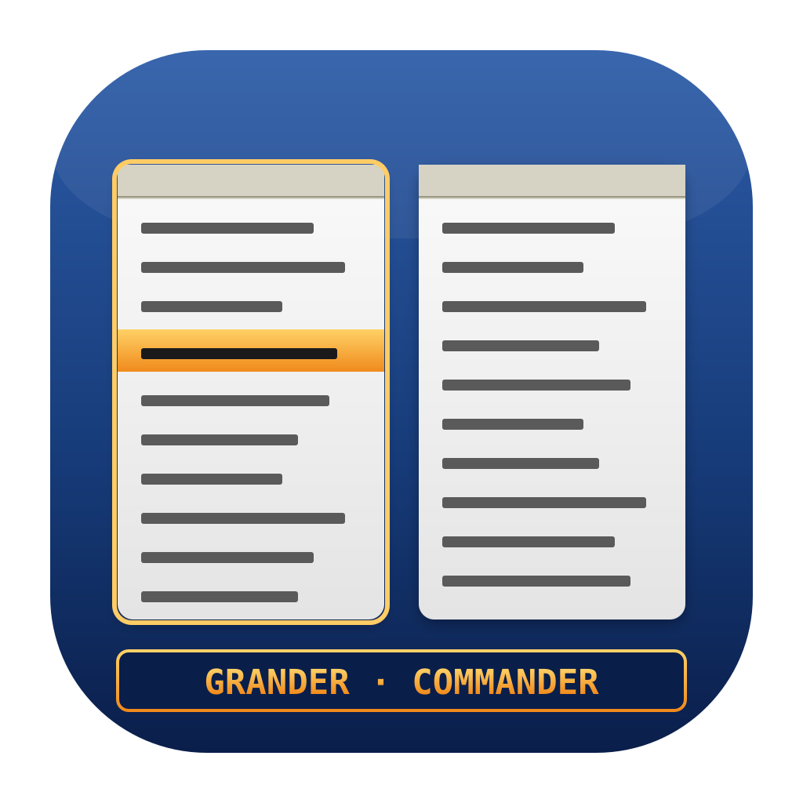
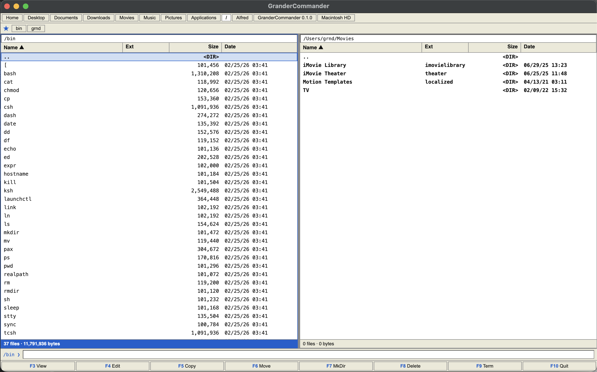

# Grander Commander

<p align="center">
  
</p>

<p align="center">
  <b>Total Commander-style dual-pane file manager for macOS.</b>
</p>

<p align="center">
  
</p>

---

## Why

I really miss Total Commander. Over the years I couldn't find anything on macOS that stuck with me — so I vibe-coded one.

## Manual

> **Hold `?` anywhere in the app for the full keyboard cheatsheet.** That's the only shortcut you need to memorize.


## Run it

Requires Node 20+ and macOS 12+.

```bash
npm install
npm run dev          # dev mode
npm run dist         # build a .dmg (unsigned)
```

## What's there

Two panels, keyboard-first navigation, quick search (`Alt+letter`), copy/move with conflict prompts, trash, Quick Look, favorites, a command line at the bottom, F-keys, context menus. See [`todo.md`](./todo.md) for what's next.

## License

[MIT](./LICENSE) © grnd
